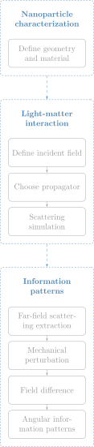

# Information Patterns Repository

This repository provides a framework for simulating optical information patterns associated with the mechanical degrees of freedom of nanoparticles. The overall procedure is summarized in the diagram below.

<p align="center">
  
</p>

A nanoparticle is first defined through its geometry and material properties. Then, an incident optical field and an electromagnetic propagator are specified using [pyGDM](https://homepages.laas.fr/pwiecha/pygdm_doc/#) to solve the light–matter interaction problem and extract the scattered far field.

Mechanical degrees of freedom are introduced as small perturbations of the nanoparticle configuration, such as center-of-mass (COM) displacements or angular rotations. The corresponding change in the far field is estimated through a centered finite difference,

$$
\frac{\partial \mathbf{E}_{\mathrm{far}}}{\partial \mu}
\approx
\frac{\mathbf{E}_{\mathrm{far}}^{+}-\mathbf{E}_{\mathrm{far}}^{-}}{2\Delta\mu},
$$

where $\mu$ denotes the mechanical coordinate of interest. This field derivative is then converted into angular information patterns as

$$
I_\mu(\theta,\phi) =
\frac{2}{\hbar \omega c}
\left|
\frac{\partial \mathbf{E}_{\mathrm{far}}}{\partial \mu}
\right|^2,
$$

which describe how information about the mechanical motion is distributed across the far-field directions collected by a detector.

The same simulated fields can also be used to compute measurement-related quantities, including **detection efficiency** over a finite collection region, optical **forces and torques**, and **recoil-heating** estimates.

---

## Repository structure

```text
info-patterns-repo/
│
├── figures/
│   └── repo_process.svg
│
├── notebooks/
│   ├── 01_com_case.ipynb
│   ├── 02_librational_case.ipynb
│   ├── 03_maxdetection_efficiency.ipynb
│   ├── 04_arbitrary_incident_field.ipynb
│   ├── 05_force_and_torque.ipynb
│   ├── 06_filling_factor.ipynb
│   ├── 07_recoil_heating.ipynb
│   └── 08_complete_pipeline.ipynb
│
├── src/
│   └── info_patterns/
│       ├── __init__.py
│       ├── constants.py
│       ├── generate_nanoparticle.py
│       ├── information_patterns_simulation.py
│       ├── light_matter_interaction_simulation.py
│       ├── measurement_tools.py
│       ├── parameters.py
│       ├── plots.py
│       └── specific_incident_fields.py
│
├── .gitignore
├── pyproject.toml
├── README.md
└── requirements.txt
```

The repository is organized as an installable Python package under `src/info_patterns/`. The `notebooks/` folder contains example workflows, while `figures/` stores visual material used in the documentation.

Package metadata and dependencies are defined through `pyproject.toml` and `requirements.txt`.

---

## Installation

Clone the repository and move into the project folder:

```bash
git clone https://github.com/barra9408/info-patterns-repo.git
cd info-patterns-repo
```

### Option 1: Standard pip installation

Install the package and its dependencies:

```bash
pip install -e .
pip install -r requirements.txt
```

Check that the package was installed correctly:

```bash
python -c "import info_patterns as ip; print('info_patterns imported successfully')"
```

Then launch Jupyter Lab to run the example notebooks:

```bash
jupyter lab
```

### Option 2: Conda installation

Create and activate a conda environment:

```bash
conda create -n info-patterns python=3.11
conda activate info-patterns
```

Install the package and its dependencies:

```bash
pip install -e .
pip install -r requirements.txt
```

Check that the package was installed correctly:

```bash
python -c "import info_patterns as ip; print('info_patterns imported successfully')"
```

Then launch Jupyter Lab:

```bash
jupyter lab
```

After installation, the package can be imported from any notebook or Python script as:

```python
import info_patterns as ip
```
The main requirements are:

```text
numpy
scipy
pandas
matplotlib
pyGDM2
jupyter
ipykernel
```
---

## Modules

### `__init__.py`

Initializes the `info_patterns` package. It imports the main submodules and exposes their public functions and constants directly from the package namespace.

### `constants.py`

Defines shared physical constants, unit conversions, coordinate conventions, material densities, and angular integration limits used across the simulations.

### `parameters.py`

Stores default parameters for common simulation cases, including nanoparticle geometry, material choice, optical sampling, incident fields, propagators, mechanical perturbations, detection regions, and plotting settings.

### `generate_nanoparticle.py`

Provides utilities to generate [pyGDM](https://homepages.laas.fr/pwiecha/pygdm_doc/#)-compatible nanoparticle geometries, assign materials, compute analytic or discrete volumes, and estimate nanoparticle mass.

### `light_matter_interaction_simulation.py`

Builds and solves the electromagnetic scattering problem. It defines incident fields, selects [pyGDM](https://homepages.laas.fr/pwiecha/pygdm_doc/#) propagators, runs scattering simulations, extracts scattered far fields, and computes field differences for center-of-mass and librational perturbations.

### `information_patterns_simulation.py`

Contains the core routine for converting scattered-field differences into total and component-wise angular information patterns.

### `measurement_tools.py`

Implements measurement-related quantities derived from the simulated fields, including detection efficiency, optical force and torque curves, trap frequencies, recoil force-noise PSD, and recoil-heating rates.

### `plots.py`

Contains plotting utilities for 2D and 3D information patterns, force-displacement curves, torque-rotation curves, and related visualization settings.

### `specific_incident_fields.py`

Defines custom incident-field models compatible with [pyGDM](https://homepages.laas.fr/pwiecha/pygdm_doc/#), including focused Gaussian fields based on the Richards-Wolf formalism and a parabolic-mirror field model.

---

## Notebooks guide

### `01_com_case.ipynb`

Computes center-of-mass information patterns for a spherical nanoparticle under the default Gaussian incident field. It evaluates COM perturbations along $x$, $y$, and $z$, and visualizes the resulting total and component-wise information patterns.

### `02_librational_case.ipynb`

Computes librational information patterns for an ellipsoidal nanoparticle under the default Gaussian incident field. It studies how small rotations around the Cartesian axes modify the scattered far field.

### `03_maxdetection_efficiency.ipynb`

Evaluates detection efficiency for COM information patterns of a spherical nanoparticle.

### `04_arbitrary_incident_field.ipynb`

Demonstrates how to use a custom incident field in the simulation pipeline. The notebook uses a parabolic-mirror field model and computes librational information patterns for an ellipsoidal nanoparticle.

### `05_force_and_torque.ipynb`

Computes optical force-displacement and torque-rotation curves for an ellipsoidal nanoparticle.

### `06_filling_factor.ipynb`

Uses a Richards-Wolf focused Gaussian field to study how the objective filling factor enters the incident-field model. It computes COM information patterns for a spherical nanoparticle under focused illumination.

### `07_recoil_heating.ipynb`

Estimates recoil force-noise PSD, trap frequencies, trap stiffness, and recoil-heating rates for a spherical nanoparticle. It connects scattered-field quantities with mechanical heating estimates.

### `08_complete_pipeline.ipynb`

Runs a complete example for an ellipsoidal nanoparticle with a parabolic-mirror incident field. It combines librational and COM information patterns, detection efficiency, optical force and torque curves, and recoil-heating estimates.